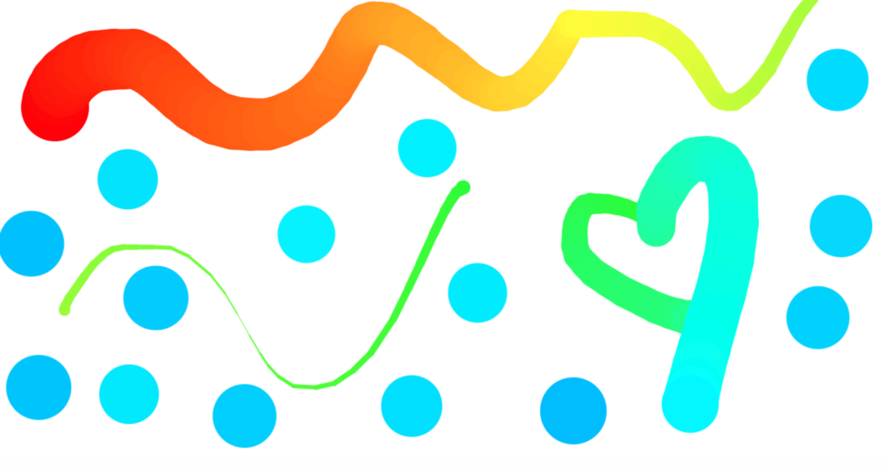

# JS30 Fun with Html Canvas

## wes bos js30 course

This is a blank canvas that gives you the opportunity a fun drawing experience with a colorful palette and developed by html canvas element and related properties. :orange_heart:

> mischief managed :herb:
